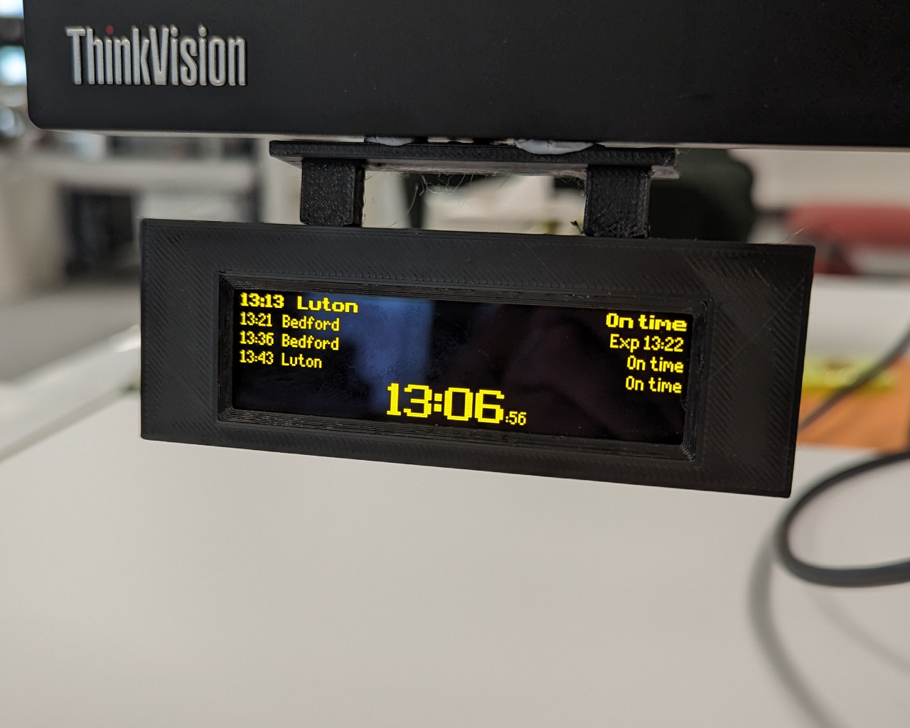
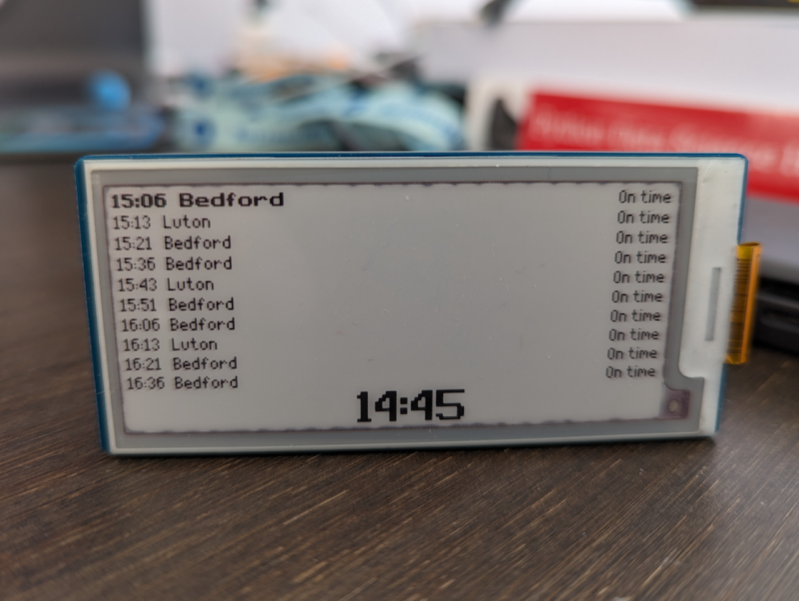

# 🚂 Pico train departure display 🚂

A MicroPython-based application for displaying near-realtime UK railway
departure times. It is designed to run on a
[Raspberry Pi Pico W](https://www.raspberrypi.com/products/raspberry-pi-pico/)
microcontroller, with an SSD1322-based 256x64 SPI OLED display.

This project uses [Realtime Trains API](https://api.rtt.io/) as its data source,
and is heavily inspired by [several other projects](#credits).

## Introduction

The goal of this project is to display a live departure board for a station,
showing trains departing for a specific destination. It's written entirely in
Python and should be able to run on any microcontroller that is capable of
running MicroPython.

It's been extensively tested on a
[Raspberry Pi Pico W](https://www.raspberrypi.com/products/raspberry-pi-pico/),
which was challenging due to its limited RAM, and with an SSD1322-based display.

## Building your own display

> TODO: Add steps on how to build the display from scratch!

## Installation

The easiest way is to install the Pico Train Dispaly software is to download the
pre-built image from the
[latest release](http://github.com/tomwardio/pico_train_display/releases/latest).
To install on a Raspberry Pi Pico:

1. Press and hold down the BOOTSEL button while you connect the other end of the
   micro-USB cable to your computer. This will put the Raspberry Pi Pico into
   USB mass storage device mode.
1. Copy the downloaded
   [`pico_train_display.uf2`](https://github.com/tomwardio/pico_train_display/releases/latest/download/pico_train_display.uf2)
   file to the mounted device. Once complete, the device should automatically
   disconnect.
1. Connect the Raspberry Pi Pico to a power supply. The display should now show
   a welcome message with details on how to connect to the setup website.
1. Follow the on-screen instructions. Once the settings are saved, the device
   should automatically restart.

You should now have a fully configured Pico-powered train display!

### Reset settings

Settings are stored in flash memory as a JSON file called `config.json`. To
reset all settings, simply delete this file. One easy way to do this is to reset
the entire flash memory, which can be done by following the official
[resetting flash memory](https://www.raspberrypi.com/documentation/microcontrollers/raspberry-pi-pico.html#resetting-flash-memory)
instructions. Once flashed, you'll need to re-install the software again.

## 🚧 Experimental Displays 🚧

Along with the SSD1322-based displays, there's also experimental support for
[2.9" e-Paper display](https://www.waveshare.com/wiki/Pico-ePaper-2.9-B). It's
doesn't look as authentic, but is also super simple to setup!

## Credits

Firstly, a massive thank you to [Dave Ingram](https://github.com/dingram) for
inspiring me to work on this project in the first place, and helping me with the
hardware and low-level driver software!

Thanks also goes to various other incantations of this project, namely
[Chris Crocker-White](https://github.com/chrisys/train-departure-display),
[Chris Hutchinson](https://github.com/chrishutchinson/train-departure-screen),
and of course [Dave](https://github.com/dingram/uk-train-display).

Also a big thank you to the wonderful folk at
[Realtime Trains](https://www.realtimetrains.co.uk/) for providing a brilliant
API for train departures.

Finally thank you to Daniel Hart who created the wonderful
[Dot Matrix](https://github.com/DanielHartUK/Dot-Matrix-Typeface) type face, and
Peter Hinch for his
[font-to-python](https://github.com/peterhinch/micropython-font-to-py) tool,
which saved my sanity.
